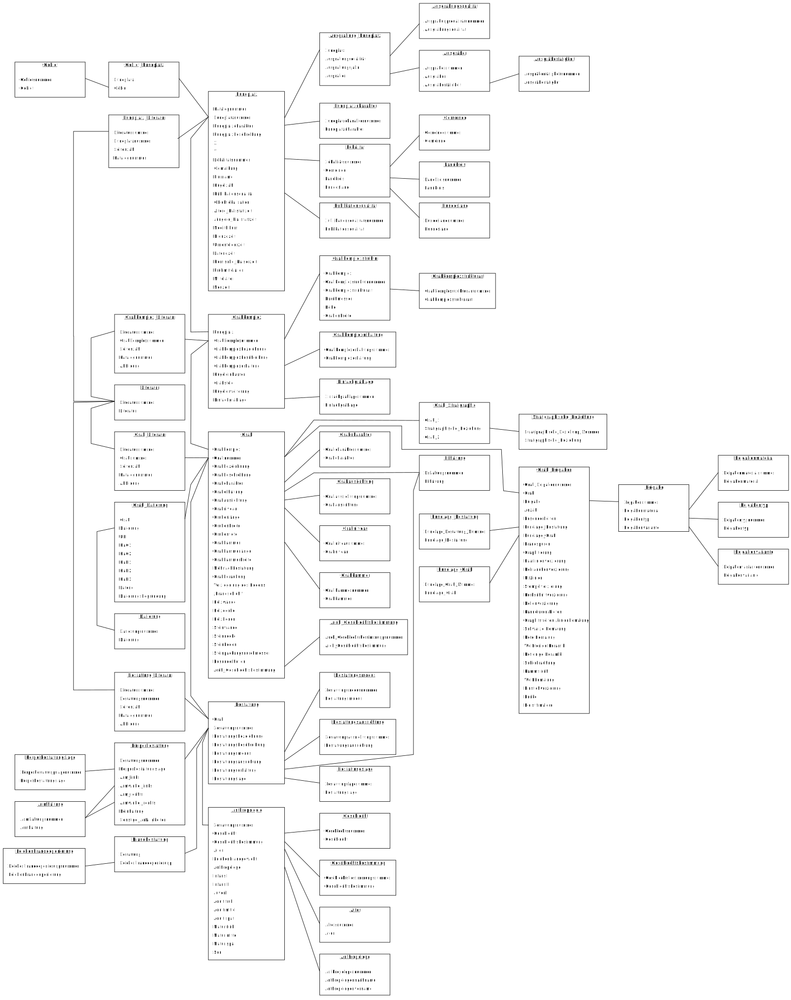

[nms2006](https://github.com/chrinne/digging.digita.data/tree/main/nms_2006) is part of the github repository [digging.digital.data](https://github.com/chrinne/digging.digita.data)

# Summary {-}

If database tables are available as text files, they can be easily imported into a database. If structural information is also available, this can also be reconstructed. This can be done quickly by hand if there are only a few tables. In the following example, however, there are 55 tables and the largely automated process presented here not only offers the advantage of being faster. It can always be called up again and can also be used as a template for similar cases. Here is the process for a somewhat more extensive relational database.

The data used derives from: 

N. Müller-Scheeßel, „Untersuchungen zum Wandel hallstattzeitlicher Bestattungssitten in Süd- und Südwestdeutschland“ (Datenbank) (Eberhard Karls Universität 2006). http://hdl.handle.net/10900/47101 (accessed: 19.10.2023).

The documentation of the original MS Access database is only used secondarily for checking and correcting. The relationships between the tables are primarily derived from the table names and field names. This results in the reconstruction of indices and the relationship of the entities, which only enables full access to the information. In this case, it is the parent table **Alter** with the field **Altersnummer** that refers to the field **Alter**  in the dependent child table **Anthropologie**:  **Alter.Altersnummer - 1:n - Anthropologie.Alter**.

If the provided text files are imported into an SQL database, keywords such as "...number" or "ID" can be extracted from the existing table definitions and checked for relationships to other table definitions. With a stringent nomenclature and structure in the genuine data, a large part of the work can be done automatically.  With the German names available here, the process is unfortunately made more difficult by the declination of the terms and umlauts.

**Important note:** In the subsequent work with the database, some errors have been noticed, both in the data processing and in the data itself. The database is therefore not yet directly consistent in the resulting form. When using the dump (SQL statements), however, the correct order of the tables in the insert statements is a fundamental problem with SQLITE ([SQLITE Forum](https://www.sqlite.org/forum/forumpost/445c0b8c74)). The data of the parent tables must be inserted before the child tables, but the sorting of the dump is always alphabetical. Given the complexity of this database, this is a serious problem. The foreign keys must therefore be deactivated and reactivated before and after importing the DUMP ('PRAGMA foreign_keys = OFF / ON;'). 

# Vorbemerkung {-}

Wenn Tabellen einer Datenbank als Textdateien vorliegen, können diese problemlos in eine Datenbank importiert werden. Liegen dann zudem Strukturinformationen vor, können diese ebenfalls rekonstruiert werden. Das ist bei wenigen Tabellen auch von Hand relativ schnell erledigt. Im folgenden Beispiel sind es aber 55 Tabellen und ein weitgehend automatisierter Prozess bietet nicht nur den Vorteil schneller zu sein. Er kann stets erneut aufgerufen und auch als Vorlage für ähnlich Fälle nachgenutzt werden. Hier also der Prozess für eine etwas umfangreichere relationale Datenbank. 

Hierbei wird die bereitgestellte Dokumentation erst sekundär, zur Kontrolle und Korrektur genutzt. Die Relationen zwischen den Tabellen werden primär aus den Tabellennamen und Feldnamen abgeleitet. Hieraus ergibt sich die Auflösung von Indices un die Beziehung der Entitäten zueinander, die erst den eigentlichen Zugang zu der enthaltenen Information ermöglichen. Im vorliegenden Fall ist es die Elterntabelle Alter mit dem Feld  Altersnummer das sich auf das Feld Alter in der abhängigen Kindtabelle Anthropolgie bezieht:  **Alter.Altersnummer - 1:n - Anthropologie.Alter**. 

Sind die Textbellen in einer SQL-Datenbank importiert, lassen sich aus den nun vorliegenden Tebellendefinitionen  Schlagworte wie "nummer" oder "ID" extrahieren und auf Beziehungen zu anderen Tabellendefinitionen überprüfen. Bei stringenter Nomenklatur und Gestaltung der genuinen Daten lässt sich so ein größerer Teil der Arbeit automatisiert erledigen.  Bei den hier vorliegenden deutschen Namen wird der Vorgang durch die Beugung (Deklination) der Begriffe und Umlaute leider erschwert.

Durch zunehmend viele Tabellen ergibt sich eher eine exponentiell als linear steigende Komplexität. Wird die Struktur dann noch von Hand erstellet, ggf. sogar über einen längeren Zeitraum, ergeben sich mit großer Wahrscheinlichkeit Unregelmäßigkeiten, vor allem in der Nomenklatur von Tabellen und Feldern.  Dies ist im nachfolgenden Fallbeispiel nur in einem geringen Maß der Fall. 

Der Transfer der Daten und die impliziten Änderungen sollten stets dokumentiert werden. Um beiden Anforderungen, der leichten Reproduzierbarkeit  und der Dokumentation zu genügen, nutze ich Markdown mit eingebauten Code-Abschnitten (*code chunks*) und nutze hierzu RStudio mit ergänzenden Paketen. In R wirklich benötigte Pakete sind RSQLite und dplyr, die anderen dienen dem Layout oder der Effizienz. 

**Wichtiger Hinweis:** In der nachfolgenden Arbeit mit der Datenbank sind einige Fehler aufgefallen, sowohl bei der Datenverarbeitung als auch bei den Daten selbst. Die Datenbank ist in der resultierenden Form also noch nicht direkt konsistent. Bei der Nutzung des Dump (SQL-Anweisungen) ist aber vor allem die korrekte Reihenfolge der Tabellen bei den Insert-Anweisungen ein grundsätzliches Problem bei SQLITE ([SQLITE Forum](https://www.sqlite.org/forum/forumpost/445c0b8c74)). Die Daten der Eltern-Tabellen müssen vor den Kind-Tabellen eingefügt werden, die Sortierung des Dump ist aber stets alphabetisch. Bei der komplexität dieser Datenbank ist das ein ernstes Problem. Vor und nach dem Import des DUMP müssen deshalb die Fremdschlüssel deaktiviert und erneut aktiviert werden ('PRAGMA foreign_keys = OFF / ON;').

```{r knitr global options, message=FALSE, include=TRUE}
# Global options for knitr
knitr::opts_chunk$set(echo=TRUE, include=TRUE, fig.align="center")
# load packages
require(pacman) || install.packages("pacman")
p_load(RSQLite, dplyr, DT, knitr, pdftools, tidyr)
```

# Datenquelle und Struktur

Die Daten wurden für folgende Publikation erfasst:

- N. Müller-Scheeßel, „Untersuchungen zum Wandel hallstattzeitlicher Bestattungssitten in Süd- und Südwestdeutschland“ (Datenbank) (Eberhard Karls Universität 2006). http://hdl.handle.net/10900/47101 (Zugriff: 19.10.2023).

Auf der zugehörigen Website befindet sich der [Link zu der zip-Datei](https://publikationen.uni-tuebingen.de/xmlui/bitstream/handle/10900/47101/html/Mue_Schee_DB.zip?sequence=1&isAllowed=y) mit den hier nachfolgend verwendeten Dateien. Es handelt sich um 55 txt-Dateien mit dem Inhalt jeder Tabelle der ursprünglichen Datenbank, einer zugehörigen Kopfzeile, Semikolon (;) als Spaltentrenner und doppelten Anführungszeichen (") bei Textfeldern. Dazu zwei PDF-Dokumente mit Angaben zur Struktur der Datenbank und ein Verzeichnis _MACOSX mit einer weiteren Datei, die das Resultat der mit Mac OS X zur Sicherheit eingeführten, erweiterten Dateiattribute ist ([Artikel bei Heise](https://www.heise.de/ratgeber/Quarantaene-in-macOS-So-schuetzt-Apple-Anwender-vor-boeser-Software-und-Dokumenten-6116134.html)). 

## Tabellen und Felddefinition

Die Datei "Tabellen_liste.pdf" enthät die Felddefinitionen für jede Tabelle und die Datei "Tabellenstruktur_Diagramm.pdf" eine Grafik zu den Relationen der Tabellen (Entity Relationship Model). Diese werden nachfolgend in leicht veränderter Form zur Information präsentiert. Im ersten Fall wird das PDF eingelesen und in eine hier darstellbare Tabelle überführt. 

```{r}
pdf_text("./nms_data/Tabellen_Liste.pdf") %>%
  gsub(" {2,40}",",", .) %>% # Spaltentrenner Leerzeichen
  gsub("([a-zä]{20,30}) ","\\1,",.) %>% # Splatentrenner nur 1 Leerzeichen
  gsub("Name, *Feldtyp, *Feldlänge\n","",.) %>% # redundante Kopfzeile
  read.csv(text = ., header = FALSE, sep = ",", 
           col.names = c("Feldname", "Feldtyp", "Feldlänge")) %>% # Text in Tabelle
#  data.frame(.) %>% # nicht notwendig
  mutate (., Tabelle = if_else(Feldtyp=="",Feldname,NA), .before= Feldname) %>% # Spalte für Tabellennamen
  fill(Tabelle) %>% # wiederholen des Tabellennamens
  filter (., Feldtyp!="") %>% # entfernen der Zeilen mit nur Tabellennamen 
  DT::datatable(., filter = "top", options=list(pagelength=10), caption="Liste der
 Tabellen mit Felddefinitionen")
```

## Relationen der Datenbank

Die Datei "Tabellenstruktur_Diagramm.pdf" wurde vorab in eine svg-Grafik konvertiert. Sie zeigt die Tabellen mit den Schlüsselfeldern in **Fett** und ihren Relationen als Linie (*entity relationship model*). 

```{r Digramm der Relationen, echo=FALSE, out.width='100%'}

```

Bei den Tabellen sind auch mehrwertige Schlüssel  aus mehreren Schlüsselfeldern vorhanden, z.B. Grab_Literatur (Literaturnummer, Grabnummer) oder Grab_Stratigraphie (Grab_1, Grab_2). Das Schlüsselfeld der Elterntabelle hat oft das Namenssuffix "nummer", in der Kindtabelle aber nicht, z.B. Grab (Grabnummer) - 1:n - Grab_Beigaben (Grab). Aus dem Kontext und den Daten ergibt sich in der Regel eine 1:n ggf. auch eine - 1:1 - Relatione, z.B. bei Grab (Grabnummer) - 1:1 - Grab_Datierung (Grab), dies ist aber nicht eindeutig benannt. 

# Datenbank via R nachbauen

Die folgende Arbeitsweise ist stark von den Möglichkeiten in R mit RSQlite geprägt. Das Grundelegende Konzept lässt sich aber auch auf alternativen Wegen, z.B. einem Editor (z.B. [notepad++](https://notepad-plus-plus.org)), mit mehr oder weniger viel Handarbeit mit regulären Ausdrücken und einem Frontend für SQLite, z.B. [DB Browser](https://sqlitebrowser.org), durchführen.

## Datentabellen importieren

Für den Datenimport nutzen wir eine Liste der zu importierenden Dateien und führen den Importbefehl über alle Elemente dieser Liste aus. Die Liste der Dateien können wir auf unterschiedlichen Wegen erstellen. Zwei sind interessant.

### Ein Ansatz (nicht weiter verfolgt)

Wir arbeiten auf der Kommandozeile (cmd) und nutzen dort seit Jahrzehnten gängige Anweisungen, hier "Liste (*DIRectory*) alle Dateien mit der Endung .txt (*\*.txt*) im einfachen Format (*/B*) und schreibe (>) dies in die Datei _liste.txt. 

```{bash Liste der Dateien erstellen, echo=TRUE, eval=FALSE, include=TRUE}
dir *.txt /B > _liste.txt
```

Dies wir anschließend noch aus dem Spaltenformat in eine mit Komma getrennte Liste in einer Zeile formatiert. Dies können wir z.B. im Editor Notepad++ durchführen: Nach "\r\n" (*return + newline*) suchen und durch ", " ersetzen. 

**Aber:** beachten Sie bitte die ggf. falsch dargestellten Umlaute der Dateinamen in der ersten Variante. Das betrifft auch den Dateiinhalt (ANSI <> UTF8). Neben der Handarbeit kann auch in der *powershell* von Windows ein Befehl alle Dateien umkopieren. Es sind zwei mit einem "|" verkettete Anweisungen. 1. Hol alle Dateinamen mit der Endung '.txt' und 2. für jedes Element dieser Liste mach folgendes: 2.1 lies den Inhalt und 2.2 schreibe diesen in den Unterordner 'utf8' mit dem identischen Namen aber umkodiert auf UTF8.   

```{bash Kodierung der Tabellen: ANSI zu UTF8, eval=FALSE, include = TRUE}
powershell
get-item *.txt | foreach-object {get-content $_ | out-file ("..\utf8\" + $_.Name) -encoding UTF8}
exit
```

### In R Daten einlesen und schreiben 

Zuerst wird eine Verbindung zu einer SQLite-Datenbank hergestellt und diese damit ggf. implizit auch angelegt. Das Objekt 'db01' repräsentiert nachfolgend diese Verbindung. 

```{r Verbindung zur Datenbank erstellen, echo=TRUE}
db01<-dbConnect(RSQLite::SQLite(), 
      dbname = "./life-table-data-haz.sqlite")
```

Für die Liste der zu importierenden Tabellen nutze ich die Funktion *list.files*. 

```{r Liste der Dateien in R erstellen, echo=TRUE, include=TRUE}
filenames<-list.files("./nms_data", pattern="*.txt", full.names=FALSE)
```

Nachfolgend können wir für jeden Dateinamen (singular) in der Liste der Dateinamen (plural) zwei Anweisungen ausführen. 1. Mit einer Zuweisung (assign) wird dem Inhalt des Objektes Dateiname (fname), z.B. Alter.txt, der Inhalt der eingelesenen Datei mit dem Dateinamen (fname) zugewiesen. 2. Das hieraus entstandene R-Objekt, ein *dataframe* (Tabelle), wird dann als Tabelle in die Datenbank geschrieben, wobei vom Dateinamen die letzten 4 Zeichen ('.txt') abgeschnitten werden. Das Problem der Kodierung wird durch die explizite Benennung gelöst.  

```{r Tabellen importieren und in DB schreiben, echo=TRUE, include=TRUE}
for (fname in filenames) {
  assign(fname, read.delim(paste0("./nms_data/", fname), sep=";", header=TRUE, 
                          dec=",", fileEncoding = "windows-1252"))
  #names with " " replaced with "." replace with "_" (e.g. Stratigraphische Nummer)
  #if (any(grepl("\\.",colnames(get(fname))))){colnames(get(fname)) <- gsub("\\.","_",colnames(get(fname)))}
  dbWriteTable(db01, substr(fname,1,nchar(fname)-4), get(fname), overwrite=TRUE)
  #tbl <- read.delim(paste0("./utf8/", fname), sep=";", header=TRUE, dec=",")
  #dbWriteTable(db01, substr(fname,1,nchar(fname)-4), tbl, overwrite=TRUE)
  #tbl <- NULL
  }
```

Der vorangehende Code enthält eine auskommentierte Variante, bei der der Dateinhalt befristet in einem  Objekt 'tbl' abgelegt, geschrieben und dann wieder gelöscht wird. Dies vermeidet redundante Datensätze. Mit der hier genutzten Variante könnte ich vor dem Export noch notwendige Modifikationen den Daten ausführen. 

Für die Tabelle Beigabenmaterial gibt es bei mir eine Warnung, die Kontrolle zeigt aber einen vollständigen Import.

Eine weitere Fehlerquelle sind ggf. die **Umlaute in den Daten und den Dateinamen**. Sowohl für die Tabellen  in R (*dataframe*) als auch in der Datenbank erstelle ich eine gefilterte Abfrage.

```{r Filter Umlaut in R}
Alter.txt %>%
  filter(., grepl("ü", Alter))
```

```{sql Filter Umlaut in SQL, connection = db01}
select * from "Alter" where "Alter" like '%ü%';
```

Als Test für eine Tabelle mit Umlaut im Namen frage ich die erste Zeile von Publikationsqualität ab.

```{r Tabelle mit Umlaut im Namen in R, eval=FALSE, include=TRUE}
Publikationsqualität.txt [1,]
```
```{sql Tabelle mit Umlaut im Namen in SQL, connection = db01, eval=FALSE, include=TRUE}
select * from "Publikationsqualität" limit 1;
```
Hier gibt es bei R und SQL einen Fehler, der aus der fehlerhaft interpretierten Kodierung des Umlautes entsteht. **Ich löse die Umlaute in den Dateinamen von Hand auf in ae und oe** und starte den Prozess einfach neu.

## Relationen

Die Daten waren in einer relationalen Datenbank (DB) organisiert. Nach dem Datenimport müssen wir diese Relationen anhand des Entity-Relationship-Model (ERM, s. Tabellenstruktur_Diagramm.pdf)  nachbauen.

> In einer relationalen DB sind die Daten nach definierten Regeln in einzelne Informationseinheiten (Entitäten) mit jeweils eigenen Tabellen  zerlegt. Jeder Datensatz (Tupel) ist eindeutig (Schlüssel) und kann über diesen mit zugehörigen Informationen nach Bedarf verbunden werden (Relation).\newline
> Meine Assoziation: **kreatives Kochen statt Tütensuppe**. 

Die im ERM dargestellte Relation kann auch direkt in SQL genutzt werden ohne eine hinterlegte Definition derselben, es erfolgt aber keine Kontrolle durch das DBMS. Als Beispiel wird nachfolgend eine Auszählung der Alters(klassen) in der Tabelle 'Anthropologie' zum Klartext in der Tabelle 'Alter' durchgeführt.

Anthropolie.Alter --n:1-- Alter.Altersnummer

```{sql, echo=TRUE, connection=db01}
select b."Alter", count(a."Alter") as "Anzahl" from Anthropologie as a
 inner join "Alter" as b on a."Alter" = b.Altersnummer 
 group by b."Alter";
```

Die SQL-Anweisung ist relativ einfach, beachten Sie die Etikettierung der Tabellen mit a und b für eine verkürzte Schreibweise der notwendigen Verweise und die Notwendigen "" für den Namen "Alter" der sonst mit der SQL-Anweisung ALTER (ändern) verwechselt würde. 

Für Abfragen können wir die immanenten Relationen nutzen. Aber für eine effiziente Nutzung ist eine implizite Definition in der DB von Vorteil.

### Relationen in SQLite nachbauen

In SQLite können Relationen, als REFERENCE bezeichnet, nicht auf vorhandenen Felder ergänzt werden. Wir können bei Tabellen aber nachträglich Spalten mit einer Referenz ergänzen,  diese dann mit dem Inhalt der originalen Spalte füllen und letztere dann auch ggf. löschen. Um die Bedingung der 1:n-Referenz zu erfüllen, muss vorab ein eindeutiger Index bei der Nachschlagetabelle (Eltern-Tabelle) ergänzt werden. 

Hier ein Beispiel mit den zuvor schon verwendeten Tabellen Alter und Anthropologie.

```{sql Index für Alter erstellen, eval=FALSE, include=TRUE, connection=db01}
create unique index 'Altersnummer' on 'Alter' (Altersnummer);
```

```{sql Alter: Spalte mit Referenz erstellen, eval=FALSE, include=TRUE, connection=db01}
alter table Anthropologie 
  add column 'Altersnummer' INTEGER REFERENCES "Alter"(Altersnummer);
```

```{sql, Alter: Inhalt der neuen Spalte schreiben, eval = FALSE, include=TRUE, connection=db01}
update Anthropologie
  set Altersnummer = "Alter";
```

### Erstellen der Schlüsselfelder

Um unnötige Handarbeit zu reduzieren, wird hier ein halbautomatischer Prozess mit vorgefertigter Syntax durchgeführt. In einem ersten Schritt wird eine Syntax für das notwendigen Schlüsselfeld (unique index) erstellt. Folgende Schritte:

1. Tabellendefinition abfragen nach Tabellen mit einer Spalte wie "...nummer",  
2. mofizieren mit gsub (Regulärer Ausdruck) und 
3. kontrollieren und korrigieren.

```{r CREATE TABLE-Anweisung für den Index umbauen}
dbGetQuery(db01, "select sql from sqlite_master where type = 'table' and (sql like '%nummer%' or sql like '%_Nummer');") %>%
  # Zeilenumbrüche in der SQL-Anweisung entfernen.
  mutate(., sql = gsub("\\n","", sql)) %>% 
  # Die CREATE TABLE - Anweisung für den Index umbauen.
  mutate(., sql = gsub("CREATE TABLE (.*) .* (`\\w*nummer`).*$","create unique index if not exists \\2 on \\1 \\2 \\);",sql)) %>%
  mutate(., sql = gsub("CREATE TABLE (.*) .* (`\\w*_Nummer`).*$","create unique index if not exists \\2 on \\1 \\2 \\);",sql)) %>%  
  mutate(., sql = gsub("CREATE TABLE (.*) .* (`\\w*.Nummer`).*$","create unique index if not exists \\2 on \\1 \\2 \\);",sql)) -> create_index  
write.csv(create_index, "./data/create_index.sql", row.names = FALSE)
```

Das Ergebnis (create_index.sql) könnte in der erstellten Textdatei von Hand editiert und abschließend in der Datenbank auch ausgeführt werden. Ich führe die notwendigen Änderungen zur Dokumentation und Nachnutzung in R durch.

```{r CREAT UNIQUe INDEX anpassen}
read.csv("./data/create_index.sql", header = TRUE) %>%
#create_index %>%
  mutate(., sql = gsub(".*`Katalognummer`.*", "", sql)) %>% # wird nicht benötigt
  mutate(., sql = gsub(".* INTEGER.*", "", sql)) %>% # wird nicht benötigt
  mutate(., sql = gsub("CREATE TABLE.*", "", sql)) %>% # fehlerhaft
  # Feld Bestattungsnummer mehrfach verwendet > Indexname eindeutig machen
  mutate(., sql = gsub("(.*)`Bestattungsnummer` on `Anthropologie`(.*)", 
     "\\1`Anthro_Bestattungsnummer` on `Anthropologie`\\2", sql)) %>%
  mutate(., sql = gsub("(.*)`Bestattungsnummer` on `Körperbestattung`(.*)", 
     "\\1`Koerper_Bestattungsnummer` on `Körperbestattung`\\2", sql)) %>%
  # Fehlende Einträge ergänzen
  rbind("create unique index if not exists `Gebiet_Fundplatz_idx` 
        on `Gebiet_Fundplatz` ( `Fundplatz` );") %>%
  rbind("create unique index if not exists `Fundplatz_Literatur_idx` 
        on `Fundplatz_Literatur` ( `Literaturnummer`,`Fundplatznummer` );") %>%
  rbind("create unique index if not exists `Fundplatz_idx` 
        on `Fundplatz` ( `Fundplatznummer` );") %>%
  rbind("create unique index if not exists `Ausgrabung_Fundplatz_idx` 
  on `Ausgrabung_Fundplatz` ( `Fundplatz`, `Ausgrabungqualität`, `Ausgrabungsjahr`, `Ausgräber` );") %>%
    rbind("create unique index if not exists `Grabkomplex_Literatur_idx` 
        on `Grabkomplex_Literatur` ( `Literaturnummer`, `Grabkomplexnummer` );") %>%
  rbind("create unique index if not exists `Grab_Stratigraphie_idx` 
        on `Grab_Stratigraphie` ( `Grab_1`, `Grab_2` );") %>%
  filter(., sql != "") -> create_index # auf "" gesetzte Einträge entfernen.
write.csv(create_index, "./data/create_index.sql", row.names = FALSE)
```

Die einspaltige Tabelle enthält nun die SQL-Anweisungen für alle Indices, die in einer Schleife einfach ausgeführt werden können.

```{r Erstellen der Indexeinträge in der Datenbank}
for (index in create_index$sql){
  dbExecute(db01, index)
} 
```

### Erstellen der Referenzen

Das eingangs dargestellte Beispiel (Tabelle Alter) zeigt ein bei zahlreichen weiteren Tabellen eingehaltenes Schema, das Feld der Kindtabelle steht im Singular 'Alter', 'Geschlechtsbestimmung' etc und das Feld in der gleichnamigen Elterntabelle erhält die Ergänzung '...nummer'. Da ist eine Schleife (*for* s. oben) natürlich verlockend. Aber das klappt wegen der Deklination (Beugung, Grammatik) nicht bei allen Feldnamen gleichermaßen. Der Prozess ist aber für alle Relationen identisch, nur die Namen sind individuell. Wir brauchen also eine Tabelle (*dataframe*) mit den jeweiligen Tabellennamen und Feldern. Im vorangehenden Beispeil also folgendes (p == parent, c == child):

| p-table | p-field | c-table | c-field |
|:------:|:------:|:------:|:------:|
| Alter | Altersnummer | Anthropologie | Alter |

Diese Tabelle können wir nach einem ähnlichen Schema wie die Indices erstellen.

```{r Elemente der Relation aus der Tabelle sqlite_master auslesen und reorganisieren.}
dbGetQuery(db01, "select sql from sqlite_master where type = 'index' and (sql like '%nummer%' or sql like '%_Nummer');") %>%
  # Die CREATE TABLE - Anweisung für die Relation umbauen.
  mutate(., p.table = gsub(".* on `(.*)` \\( `(.*)`.*$","\\1",sql)) %>%
  mutate(., p.field = gsub(".* on `(.*)` \\( `(.*)`.*$","\\2",sql)) %>%
  mutate(., p.field = gsub(".*,.*", "", p.field)) %>%
  filter(., p.field != "") -> create_relation
```

Bezogen auf das Beispiel 'Alter' (s.o.) müssen wir die Tabelle finden, in der das Feld 'Alter' definiert ist. Die SQL-ASnweisung lautet wie folgt:

```{sql Beispiel Alter Kind-Tabelle finden, connection=db01}
select tbl_name from sqlite_master where sql like '%`Alter`%' and type = 'table'  and tbl_name <> 'Alter';
```

Es ist aber nicht ganz so einfach, denn 1) kann die Referenz auf die Elterntabelle auch in mehreren Kind-Tabelle genutzt werden, Bsp. Fundplatz(nummer) und 2) ist die Nomenklatur für das Feld in der Kindtabelle nicht eindeutig (Fundplatz und Fundplatznummer). Die folgenden Tabellen verweisen alle auf die Tabelle Fundplatz mit dem Schlüsselfeld Fundplatznummer:

```{sql Beispiel Fundplatz Kind-Tabelle finden, connection=db01}
select tbl_name from sqlite_master where (sql like '%`Fundplatz`%' or sql like '%`Fundplatznummer`%') and 
  type = 'table'  and tbl_name <> 'Fundplatz';
```

Ich ignoriere das zweite Problem vorerst, das wird Handarbeit, und erstellen eine weitere Tabelle für den ersten Fall.

```{r Alle Kindtabellen finden}
tbl_names<-data.frame(c_table = "", c_field = "")
for (relation in create_relation$p.table) {
  dbGetQuery(db01, paste0("select tbl_name as c_table, '", relation ,"' as c_field from sqlite_master 
                          where sql like '%", relation, "`%' and type = 'table' and 
                          tbl_name <> '", relation, "';")) -> new_tbl_names
  if (nrow(new_tbl_names) > 0){
    rbind(tbl_names, new_tbl_names) -> tbl_names
  } 
} 
tbl_names %>%
  distinct(.) %>%
  filter(., c_table != "")-> tbl_names
#save(tbl_names, file="./data/tbl_names.Rda")
```

Diese zuvor erstellten Tabellen werden nun pauschal über den Namen der Elterntabelle mit dem meist gleichnamigen Feldnamen der Kindtabelle  verbunden. 

```{r Relationen: Für die Elterntabellen alle Kindtabellen finden}
#load("./data/tbl_names.Rda")
right_join(create_relation, tbl_names, join_by(p.table==c_field), keep = TRUE) %>%
  select(., !(sql)) -> create_relation
```

Jetzt folgt die Kontrolle und Handarbeit.

```{r Relationen: Korrektur der automatisch generierten Relationen}
create_relation %>%
  filter(., !(c_table == "Fundplatz"  & c_field == "Alter")) %>%
  filter(., !(c_table == "Koerperbestattung"  & c_field == "Bestattungslage")) %>%
  filter(., !(c_table == "Koerperbestattungslage"  & c_field == "Bestattungslage")) %>%
  filter(., !(c_table == "Grab"  & c_field == "Erhaltung")) %>%
  filter(., !(c_table == "Bestattung"  & c_field == "Erhaltung")) %>%
  filter(., !(c_table == "Grabkomplex"  & c_field == "Erhaltung")) %>%
  filter(., !(c_table == "Grabkomplexerhaltung"  & c_field == "Erhaltung")) %>%
  filter(., !(c_table == "Arch_Geschlechtsbestimmung"  & c_field == "Geschlechtsbestimmung")) %>%
  filter(., !(c_table == "Grab"  & c_field == "Geschlechtsbestimmung")) %>%
  filter(., !(c_table == "Grab_Stratigraphie"  & c_field == "Stratigraphische_Beziehung")) %>%  
  rbind(., c("Erhaltung","Erhaltungsnummer","Grab","Graberhaltung")) %>%
  rbind(., c("Erhaltung","Erhaltungsnummer","Bestattung","Bestattungserhaltung")) %>%
  mutate(., c_field = if_else(c_field == "Literatur","Literaturnummer",c_field)) %>% 
  mutate(., p.field = if_else(p.field == "Literaturnummer","Literatur",p.field)) -> create_relation
```

Damit ist die Tabelle der zu erstellenden Relationen fertig. Diese müssen nun abgearbeitet werden

```{r Relationen in die Datenbank schreiben und die neuen Spalten füllen}
for (i in 1:nrow(create_relation)){
  relation <- create_relation[i,]
  dbExecute(db01, paste0("alter table '", relation[1,3], 
                         "' add column '", relation[1,2], 
                         "' INTEGER REFERENCES '", 
                         relation[1,1],"'(",relation[1,2],");"))
 dbExecute(db01, paste0("update '", relation[1,3], "' as a ", 
                        " set '", relation[1,2], 
                        "' = a.'", relation[1,4], "';")) 
} 
```

Die Datenbankanbindung in R geht direkt in die Datenbank selbst, damit ist der in SQLite anwendbare Befehl für eine Sicherung der gesamten DB als Textdatein (dump) ```$ sqlite3 beispieldb .dump``` hier nicht möglich. In einer Nutzeroberfläche (z.B. DB Browser for SQLite) ist dies aber über das Menü möglich. In dieser textbasierten Sicherungsdatei sind dann die Datenstruktur und die Daten gesichert.
